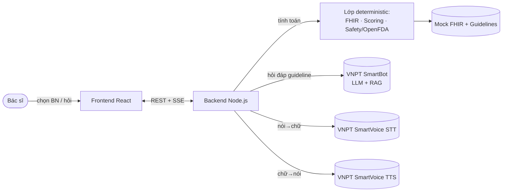
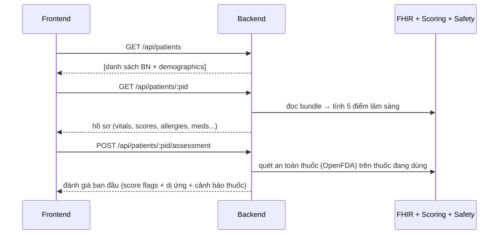
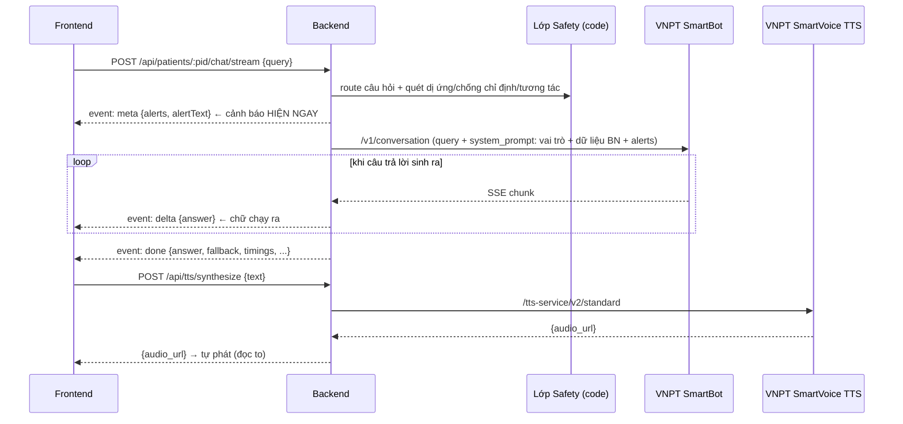
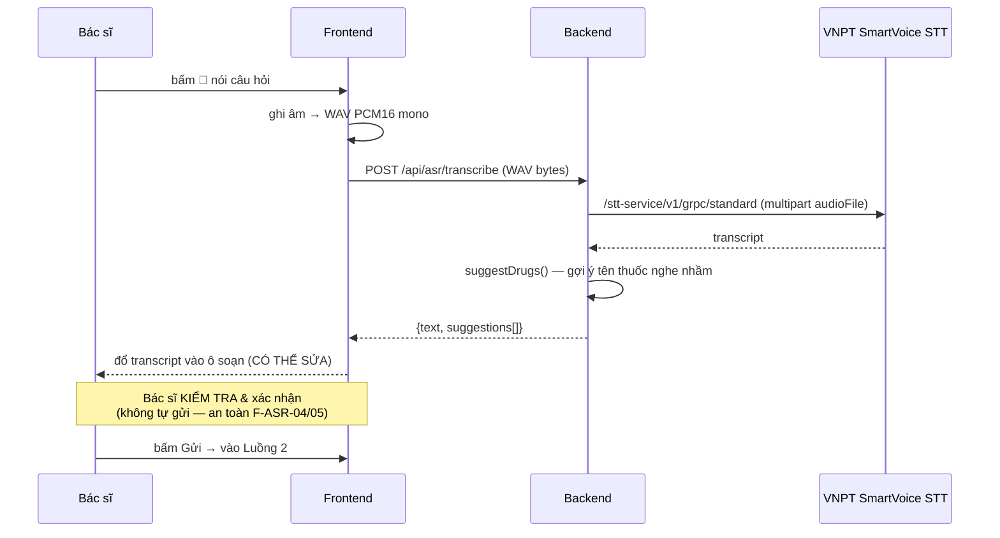

# Luồng sản phẩm — Trợ lý Giọng nói Khoa Hồi sức (ICU)

> Tài liệu mô tả toàn bộ luồng nghiệp vụ, input/output từng bước, và điểm tích hợp VNPT.
> Stack: **React (frontend)** + **Node.js/Express (backend orchestration)** + **VNPT SmartBot/SmartVoice (AI)**.

---

## 1. Tổng quan sản phẩm

Bác sĩ ICU chọn bệnh nhân → hệ thống tự tính **điểm lâm sàng** + **quét an toàn thuốc** (deterministic, không LLM) → bác sĩ hỏi (gõ hoặc **nói**) → nhận tư vấn dựa trên **guideline** (qua VNPT SmartBot), câu trả lời **hiện dần + đọc to** (VNPT SmartVoice TTS).

**Nguyên tắc cốt lõi:** Mọi cảnh báo an toàn (dị ứng, chống chỉ định, tương tác thuốc, điểm nguy kịch) được tính **bằng code, chạy TRƯỚC và độc lập với AI**, luôn hiển thị đầu tiên. AI chỉ lo phần tư vấn guideline.

---

## 2. Các thành phần & vai trò

| Thành phần | Vai trò | Input | Output |
|---|---|---|---|
| **Frontend** (React/Vite) | Giao diện chọn BN, chat, ghi âm, phát audio | Tương tác bác sĩ | Gọi REST/SSE tới backend |
| **Backend** (Node/Express) | Orchestration: ghép dữ liệu + gọi VNPT | HTTP request | JSON / SSE stream |
| **FHIR client** | Đọc hồ sơ bệnh nhân (mock bundle) | file `patient_X.json` | `patient_context` |
| **Scoring** | Tính MAP/qSOFA/SOFA/NEWS2/eGFR | `patient_context` | điểm + cảnh báo |
| **Safety** | Quét dị ứng/chống chỉ định/tương tác | thuốc + `patient_context` | danh sách alert |
| **VNPT SmartBot** | Sinh câu trả lời từ guideline (RAG) | câu hỏi + `system_prompt` | câu trả lời (text, SSE) |
| **VNPT SmartVoice STT** | Nói → chữ | WAV PCM16 mono | transcript |
| **VNPT SmartVoice TTS** | Chữ → nói | text | URL file audio |

---

## 3. Luồng 1 — Chọn bệnh nhân & đánh giá ban đầu

**Input/Output:**
- `GET /api/patients` → `[{id, name, gender, age, description}]`
- `GET /api/patients/:pid` → `{name, age, gender, encounter, allergies[], conditions[], medications[], vitals[], scores{map,qsofa,sofa,news2,egfr}, summary}`
- `POST /api/patients/:pid/assessment` → `{kind:"assessment", score_flags[], allergies[], drug_alerts[], conditions[], note}` — **deterministic, không gọi LLM**

---

## 4. Luồng 2 — Hỏi bằng văn bản (streaming)

**Chi tiết:**
- **Endpoint:** `POST /api/patients/:pid/chat/stream` — body `{query}`, trả **SSE**
- **Thứ tự event SSE:** `meta` (alerts deterministic, tức thì) → nhiều `delta` (câu trả lời lớn dần) → `done` (payload cuối) → hoặc `error`
- **system_prompt** bơm vào SmartBot gồm: vai trò trợ lý ICU + tóm tắt bệnh nhân + điểm số đã tính sẵn + khối cảnh báo an toàn + yêu cầu trích dẫn tên guideline
- **Frontend:** chữ hiện dần (typewriter), cảnh báo an toàn hiện ngay (không animate), TTS đọc to song song khi xong
- **Fallback:** nếu SmartBot không trả/được chuyển GDV → câu "Không đủ thông tin trong guideline..."

> Có bản non-streaming `POST /api/patients/:pid/chat` (trả JSON 1 lần) dùng cho tích hợp khác.

---

## 5. Luồng 3 — Hỏi bằng giọng nói (push-to-talk)

**Input/Output:**
- `POST /api/asr/transcribe` — body: **WAV PCM 16bit mono** (≤10MB, ~3–10s), header `Content-Type: audio/wav`
- → `{text, latency_s, suggestions[{span, suggestion, score, alternatives[]}]}`
- **Suggest-only:** chỉ gợi ý tên thuốc, **không tự sửa transcript**. Bác sĩ xác nhận trước khi gửi.

---

## 6. Luồng 4 — Đọc to câu trả lời (TTS)

- `POST /api/tts/synthesize` — body `{text}` → `{audio_url}` (file .wav hosted trên VNPT, cache 24h)
- Frontend phát thẳng qua `<audio src>`. Tự phát khi câu trả lời xong + nút 🔊 để nghe lại.
- Giọng cấu hình qua env: `TTS_REGION` (female_north/...), `TTS_MODEL` (news/books).

---

## 7. Bảng API tổng hợp

| Method | Endpoint | Input | Output |
|---|---|---|---|
| GET | `/api/patients` | — | danh sách BN |
| GET | `/api/patients/:pid` | — | hồ sơ + điểm lâm sàng |
| POST | `/api/patients/:pid/assessment` | — | đánh giá ban đầu (deterministic) |
| POST | `/api/patients/:pid/chat` | `{query}` | câu trả lời (JSON, 1 lần) |
| POST | `/api/patients/:pid/chat/stream` | `{query}` | **SSE**: meta→delta→done |
| POST | `/api/asr/transcribe` | WAV bytes | `{text, suggestions}` |
| POST | `/api/tts/synthesize` | `{text}` | `{audio_url}` |
| GET | `/api/health` | — | `{ok:true}` |

---

## 8. Điểm tích hợp VNPT

| Dịch vụ | Endpoint | Auth | Ghi chú |
|---|---|---|---|
| **SmartBot** | `POST https://assistant-stream.vnpt.vn/v1/conversation` | Bearer + Token-id + Token-key | RAG từ knowledge base; bật "tri thức nâng cao" để dùng `system_prompt`; bật streaming để trả chunk |
| **SmartVoice STT** | `POST https://api.idg.vnpt.vn/stt-service/v1/grpc/standard` | (token STT riêng) | multipart `audioFile` + `clientSession`; WAV PCM16 mono |
| **SmartVoice TTS** | `POST https://api.idg.vnpt.vn/tts-service/v2/standard` | (token TTS riêng) | trả `playlist[0].audio_link` |

> STT và TTS là **2 API + 2 bộ token khác nhau** (chung domain `api.idg.vnpt.vn`). SmartBot ở domain riêng `assistant-stream.vnpt.vn`.

---

## 9. Lớp an toàn lâm sàng (chạy bằng code, không phải LLM)

| Kiểm tra | Nguồn | Khi nào chạy |
|---|---|---|
| Điểm nguy kịch (NEWS2 cao, qSOFA+, MAP thấp, eGFR điều chỉnh liều) | `scoring/calculator.js` | mỗi lần tải hồ sơ |
| Dị ứng (kèm nhóm chéo, vd Penicillin→Amoxicillin) | `safety/safety.js` (rule) | trước mỗi câu trả lời |
| Chống chỉ định thuốc ↔ bệnh nền | OpenFDA | trước mỗi câu trả lời |
| Tương tác thuốc ↔ thuốc | OpenFDA | trước mỗi câu trả lời |

→ Kết quả gửi trong event `meta` (hiện **trước** câu trả lời AI). AI **không** quyết định an toàn; nếu AI thiếu dữ liệu → từ chối thay vì bịa.

---

## 10. Nguồn dữ liệu

- **Bệnh nhân:** 18 mock FHIR R4 bundle (`data/mock/patient_A..R.json`) — đa dạng tình huống (sepsis, ARDS, AKI, MI, suy gan, thai kỳ, nhi, lão...).
- **Tri thức (guideline):** 4 file ICU upload lên SmartBot knowledge base:
  - `quy_trinh_icu_vn.md` (Quy trình ICU — BYT 2014)
  - `icu_2015.md` (Hồi sức tích cực — BYT 2015)
  - `ssc_2021.md` (Surviving Sepsis Campaign 2021)
  - `tt51_phan_ve.md` (TT-51/2017 phản vệ)
- **OpenFDA:** nhãn thuốc FDA (chống chỉ định + tương tác).

---

## 11. Trạng thái & việc cần làm

- ✅ Backend Node + lớp deterministic (scoring verify 18/18 parity với bản Python gốc)
- ✅ Streaming chat (SSE) + typewriter + auto-TTS
- 🔧 **Bật quyền STT** cho token trên portal VNPT (hiện 401 "No permission")
- 🔧 **Nạp knowledge base** SmartBot: đổi guideline `.md`→`.txt`, upload, **Huấn luyện**, thêm Thẻ tri thức / dùng template GenAI RAG
- 🔧 (tùy chọn) **Bật streaming** trên SmartBot để chữ ra sớm hơn
- ⏭️ STT streaming real-time qua gRPC (sau khi có quyền token)
